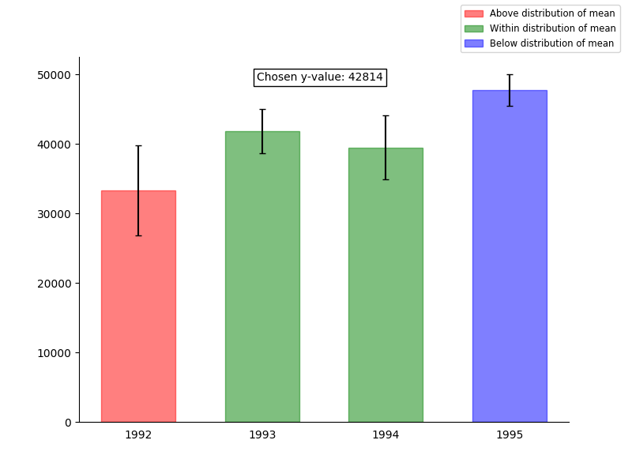

# Interactive Plotting
This project was part of a Data Science course taught at University of Michigan via [Coursera](https://www.coursera.org/learn/python-plotting/home/welcome).

The goal of this project was to utilize events in matplotlib in order to build interactive plots.

The objective was:

1. Plot random data into 4 differing categories.
2. Plot with whiskers the mean and the calculated error margin of each category defined in step (1) 
3. Build interactivity where the user selects a y-value and the bar coloring changes depends on if the chosen y-value is within or outside the distribution of the mean for each bar.

## Resulting graph

## Main Packages Used
* Pandas -- For data manipulation
* Matplotlib -- For data visualization

## Learnings
* Interactive plotting
* Cursor events
* User picked events
